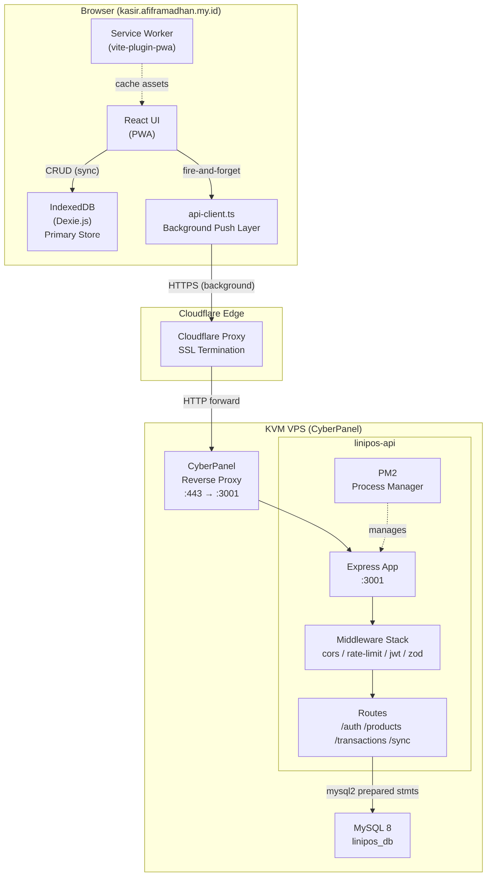
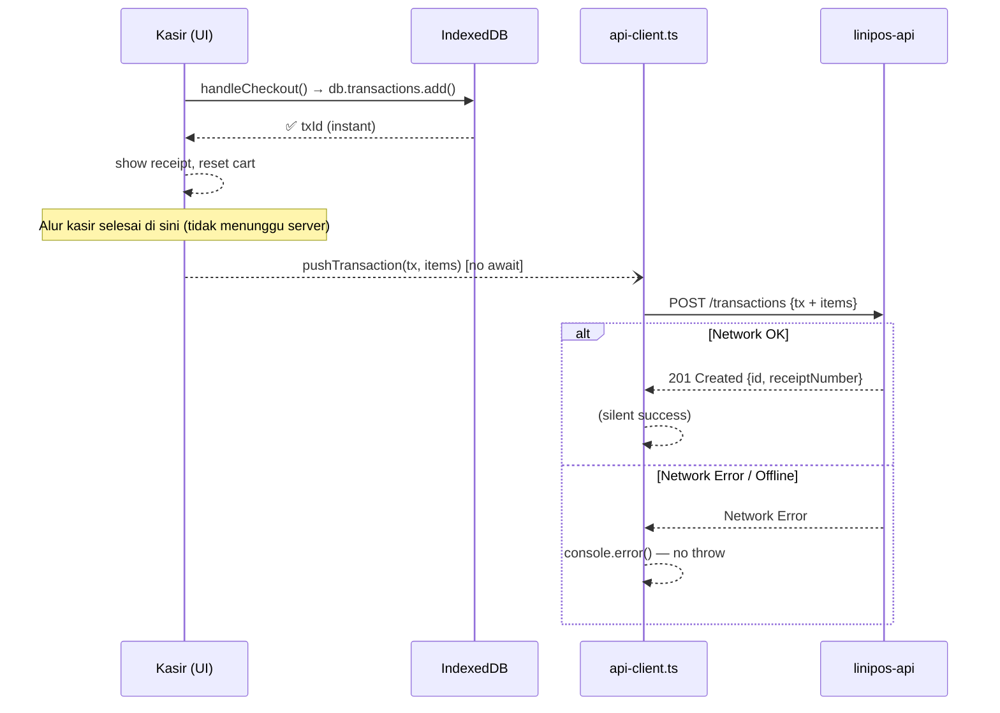
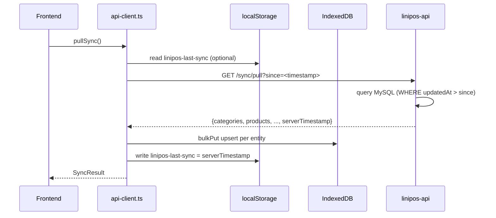
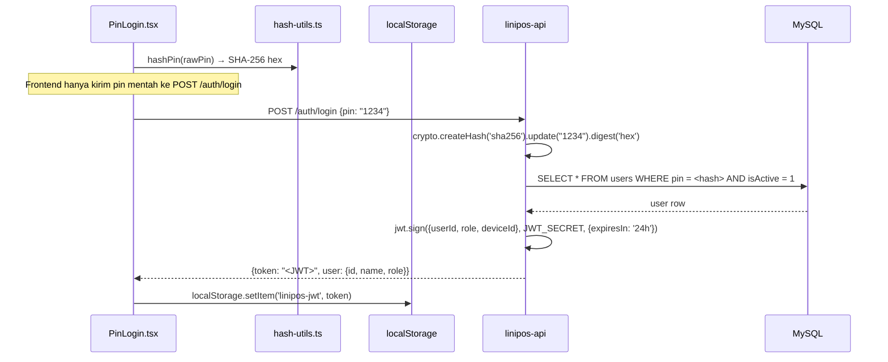
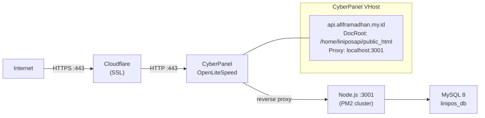

# Design Document: Backend Cloud Sync

## Overview

Fitur ini menambahkan layer backend terpusat ke sistem Lini POS yang saat ini berjalan sepenuhnya *client-side*. Strategi utama adalah **Offline-First + Background Push**: IndexedDB (Dexie.js) tetap menjadi *primary store* di perangkat kasir sehingga seluruh operasi POS tetap berjalan tanpa koneksi internet. Setelah setiap operasi IndexedDB berhasil, data secara asinkron di-push ke server di background tanpa memblokir UI kasir.

### Design Goals

1. **Zero UX disruption** — Kasir tidak merasakan perubahan alur kerja apapun; tidak ada spinner, delay, atau notifikasi tambahan dari proses sync
2. **Resilient offline** — Seluruh operasi POS (checkout, simpan produk, open bill) tetap berjalan penuh saat offline
3. **Silent background sync** — Push ke server adalah *fire-and-forget*; kegagalan jaringan tidak terekspos ke user
4. **IndexedDB sebagai source of truth** — Server adalah cloud backup, bukan primary database
5. **Minimal frontend changes** — Hanya menambahkan `api-client.ts` dan beberapa *fire-and-forget* call setelah operasi lokal selesai

### Tech Stack

**Backend (`linipos-api`)**:
- Runtime: Node.js 20 LTS
- Language: TypeScript 5.x (dikompilasi ke JavaScript sebelum produksi)
- Framework: Express 4.x
- Database driver: `mysql2` dengan connection pool (prepared statements)
- Auth: `jsonwebtoken` untuk JWT, Node.js `crypto` untuk PIN hashing
- Validation: `zod`
- Rate limiting: `express-rate-limit`
- Process manager: PM2

**Infrastructure**:
- Server: KVM VPS dengan CyberPanel (OpenLiteSpeed)
- Domain: `api.afiframadhan.my.id`
- SSL: Cloudflare termination di edge — backend berjalan di plain HTTP `localhost:3001`
- Reverse proxy: CyberPanel → `localhost:3001`

---

## Architecture

### High-Level Architecture Diagram



### Request Flow — Background Push (Checkout)



### Request Flow — Sync Pull (New Device / Re-sync)



### Authentication Flow — PIN → JWT



### Deployment Architecture



---

## Components and Interfaces

### Backend: Struktur Folder `linipos-api`

```
linipos-api/
├── src/
│   ├── index.ts                   # Entry point: setup Express, apply middleware, mount routes
│   ├── config.ts                  # Read & validate env vars (throw if missing)
│   ├── db.ts                      # mysql2 pool singleton
│   │
│   ├── middleware/
│   │   ├── auth.ts                # JWT verification middleware (req.user)
│   │   ├── validate.ts            # Zod validation factory middleware
│   │   └── requestLogger.ts       # Log method, path, status, response time
│   │
│   ├── routes/
│   │   ├── auth.ts                # POST /auth/login, POST /auth/sync-user
│   │   ├── products.ts            # GET/POST /products, PUT /products/:id, POST /products/batch
│   │   ├── transactions.ts        # POST /transactions, GET /transactions
│   │   └── sync.ts                # GET /sync/pull
│   │
│   ├── schemas/
│   │   ├── auth.schemas.ts        # Zod schemas untuk login, sync-user request bodies
│   │   ├── product.schemas.ts     # Zod schemas untuk product upsert
│   │   └── transaction.schemas.ts # Zod schemas untuk transaction + items
│   │
│   └── types/
│       └── express.d.ts           # Augment Express Request dengan req.user
│
├── migrations/
│   └── 001_initial_schema.sql     # Idempotent CREATE TABLE IF NOT EXISTS
│
├── .env.example                   # Template environment variables
├── ecosystem.config.cjs           # PM2 config
├── deploy.sh                      # Deployment script
├── package.json
└── tsconfig.json
```

### Frontend: File Baru yang Ditambahkan

```
src/
├── lib/
│   └── api-client.ts              # Semua komunikasi HTTP ke linipos-api
└── (tidak ada perubahan file lain, hanya tambahan fire-and-forget calls)
```

### API Client Interface (`api-client.ts`)

```typescript
// Public API yang diekspos oleh api-client.ts

export interface SyncPullResult {
  categories: Category[];
  products: Product[];
  suppliers: Supplier[];
  paymentMethods: PaymentMethod[];
  variantGroups: VariantGroup[];
  variantOptions: VariantOption[];
  storeSettings: Partial<StoreSettings>;
  users: Omit<User, 'pin'>[];
  serverTimestamp: string; // ISO 8601
}

// Fire-and-forget functions — tidak pernah throw ke caller
export async function pushTransaction(
  tx: Transaction,
  items: TransactionItemRecord[]
): Promise<void>

export async function pushProduct(product: Product): Promise<void>

export async function syncUser(user: User): Promise<void>

export async function pullSync(since?: string): Promise<SyncPullResult | null>

export async function login(pin: string): Promise<{
  token: string;
  user: { id: number; name: string; role: 'owner' | 'kasir' };
} | null>
```

### Backend Middleware Stack (per request)

```
Request
  ↓
requestLogger (log start)
  ↓
cors (allow kasir.afiframadhan.my.id)
  ↓
express.json() (parse body, max 10mb untuk base64 photo)
  ↓
rateLimiter (hanya pada POST /auth/login)
  ↓
authMiddleware (verify JWT, skip pada /auth/* dan /health)
  ↓
Route Handler
  ↓
validate (Zod schema check pada req.body)
  ↓
Business Logic + mysql2 query
  ↓
JSON Response
  ↓
requestLogger (log end: status + ms)
```

---

## Data Models

### MySQL Schema (`migrations/001_initial_schema.sql`)

Schema MySQL mencerminkan struktur Dexie.js yang ada di `src/lib/db.ts`, dengan beberapa adaptasi (TINYINT untuk boolean, MEDIUMTEXT untuk base64 photo, ENUM untuk tipe terbatas).

```sql
-- ============================================================
-- Lini POS — Initial Schema (idempotent)
-- ============================================================

CREATE DATABASE IF NOT EXISTS linipos_db CHARACTER SET utf8mb4 COLLATE utf8mb4_unicode_ci;
USE linipos_db;

-- ── users ────────────────────────────────────────────────────
CREATE TABLE IF NOT EXISTS users (
  id         INT UNSIGNED AUTO_INCREMENT PRIMARY KEY,
  name       VARCHAR(100)    NOT NULL,
  pin        VARCHAR(64)     NOT NULL COMMENT 'SHA-256 hex of 4-digit PIN',
  role       ENUM('owner','kasir') NOT NULL DEFAULT 'kasir',
  isActive   TINYINT(1)      NOT NULL DEFAULT 1,
  createdAt  DATETIME        NOT NULL DEFAULT CURRENT_TIMESTAMP,
  INDEX idx_users_role (role)
) ENGINE=InnoDB DEFAULT CHARSET=utf8mb4;

-- ── categories ───────────────────────────────────────────────
CREATE TABLE IF NOT EXISTS categories (
  id         INT UNSIGNED AUTO_INCREMENT PRIMARY KEY,
  name       VARCHAR(100)    NOT NULL,
  color      VARCHAR(20)     NOT NULL DEFAULT '#95A5A6',
  icon       VARCHAR(10)     NOT NULL DEFAULT '📦',
  createdAt  DATETIME        NOT NULL DEFAULT CURRENT_TIMESTAMP,
  updatedAt  DATETIME        NOT NULL DEFAULT CURRENT_TIMESTAMP ON UPDATE CURRENT_TIMESTAMP,
  isDeleted  TINYINT(1)      NOT NULL DEFAULT 0,
  deletedAt  DATETIME        NULL,
  INDEX idx_categories_isDeleted (isDeleted)
) ENGINE=InnoDB DEFAULT CHARSET=utf8mb4;

-- ── products ─────────────────────────────────────────────────
CREATE TABLE IF NOT EXISTS products (
  id             INT UNSIGNED AUTO_INCREMENT PRIMARY KEY,
  name           VARCHAR(255)    NOT NULL,
  sku            VARCHAR(100)    NOT NULL,
  categoryId     INT UNSIGNED    NOT NULL,
  price          DECIMAL(15,2)   NOT NULL DEFAULT 0,
  hpp            DECIMAL(15,2)   NOT NULL DEFAULT 0,
  stock          INT             NOT NULL DEFAULT 0,
  unit           VARCHAR(20)     NOT NULL DEFAULT 'pcs',
  photo          MEDIUMTEXT      NULL COMMENT 'base64 encoded compressed image',
  description    TEXT            NULL,
  unlimitedStock TINYINT(1)      NOT NULL DEFAULT 0,
  barcode        VARCHAR(100)    NULL,
  sortOrder      INT             NOT NULL DEFAULT 0,
  isActive       TINYINT(1)      NOT NULL DEFAULT 1,
  createdAt      DATETIME        NOT NULL DEFAULT CURRENT_TIMESTAMP,
  updatedAt      DATETIME        NOT NULL DEFAULT CURRENT_TIMESTAMP ON UPDATE CURRENT_TIMESTAMP,
  isDeleted      TINYINT(1)      NOT NULL DEFAULT 0,
  deletedAt      DATETIME        NULL,
  UNIQUE KEY uq_products_sku (sku),
  INDEX idx_products_categoryId (categoryId),
  INDEX idx_products_isDeleted (isDeleted),
  INDEX idx_products_isActive (isActive)
) ENGINE=InnoDB DEFAULT CHARSET=utf8mb4;

-- ── suppliers ────────────────────────────────────────────────
CREATE TABLE IF NOT EXISTS suppliers (
  id        INT UNSIGNED AUTO_INCREMENT PRIMARY KEY,
  name      VARCHAR(200)    NOT NULL,
  phone     VARCHAR(50)     NOT NULL DEFAULT '',
  address   TEXT            NOT NULL DEFAULT '',
  notes     TEXT            NOT NULL DEFAULT '',
  createdAt DATETIME        NOT NULL DEFAULT CURRENT_TIMESTAMP,
  updatedAt DATETIME        NOT NULL DEFAULT CURRENT_TIMESTAMP ON UPDATE CURRENT_TIMESTAMP,
  isDeleted TINYINT(1)      NOT NULL DEFAULT 0,
  deletedAt DATETIME        NULL
) ENGINE=InnoDB DEFAULT CHARSET=utf8mb4;

-- ── stockIns ─────────────────────────────────────────────────
CREATE TABLE IF NOT EXISTS stockIns (
  id         INT UNSIGNED AUTO_INCREMENT PRIMARY KEY,
  productId  INT UNSIGNED    NOT NULL,
  supplierId INT UNSIGNED    NOT NULL,
  quantity   INT             NOT NULL DEFAULT 0,
  buyPrice   DECIMAL(15,2)   NOT NULL DEFAULT 0,
  totalPrice DECIMAL(15,2)   NOT NULL DEFAULT 0,
  date       DATETIME        NOT NULL,
  notes      TEXT            NOT NULL DEFAULT '',
  createdAt  DATETIME        NOT NULL DEFAULT CURRENT_TIMESTAMP,
  INDEX idx_stockIns_productId (productId),
  INDEX idx_stockIns_date (date)
) ENGINE=InnoDB DEFAULT CHARSET=utf8mb4;

-- ── stockOuts ────────────────────────────────────────────────
CREATE TABLE IF NOT EXISTS stockOuts (
  id        INT UNSIGNED AUTO_INCREMENT PRIMARY KEY,
  productId INT UNSIGNED    NOT NULL,
  quantity  INT             NOT NULL DEFAULT 0,
  reason    VARCHAR(200)    NOT NULL DEFAULT '',
  date      DATETIME        NOT NULL,
  notes     TEXT            NOT NULL DEFAULT '',
  createdAt DATETIME        NOT NULL DEFAULT CURRENT_TIMESTAMP,
  INDEX idx_stockOuts_productId (productId),
  INDEX idx_stockOuts_date (date)
) ENGINE=InnoDB DEFAULT CHARSET=utf8mb4;

-- ── hppHistory ───────────────────────────────────────────────
CREATE TABLE IF NOT EXISTS hppHistory (
  id        INT UNSIGNED AUTO_INCREMENT PRIMARY KEY,
  productId INT UNSIGNED    NOT NULL,
  oldHpp    DECIMAL(15,2)   NOT NULL DEFAULT 0,
  newHpp    DECIMAL(15,2)   NOT NULL DEFAULT 0,
  source    ENUM('stock_in','manual') NOT NULL,
  date      DATETIME        NOT NULL,
  createdAt DATETIME        NOT NULL DEFAULT CURRENT_TIMESTAMP,
  INDEX idx_hppHistory_productId (productId)
) ENGINE=InnoDB DEFAULT CHARSET=utf8mb4;

-- ── paymentMethods ───────────────────────────────────────────
CREATE TABLE IF NOT EXISTS paymentMethods (
  id        INT UNSIGNED AUTO_INCREMENT PRIMARY KEY,
  name      VARCHAR(100)    NOT NULL,
  category  VARCHAR(50)     NOT NULL DEFAULT 'tunai',
  isDefault TINYINT(1)      NOT NULL DEFAULT 0,
  createdAt DATETIME        NOT NULL DEFAULT CURRENT_TIMESTAMP,
  updatedAt DATETIME        NOT NULL DEFAULT CURRENT_TIMESTAMP ON UPDATE CURRENT_TIMESTAMP
) ENGINE=InnoDB DEFAULT CHARSET=utf8mb4;

-- ── transactions ─────────────────────────────────────────────
CREATE TABLE IF NOT EXISTS transactions (
  id              INT UNSIGNED AUTO_INCREMENT PRIMARY KEY,
  subtotal        DECIMAL(15,2)   NOT NULL DEFAULT 0,
  discountType    ENUM('percentage','nominal') NULL,
  discountValue   DECIMAL(15,2)   NOT NULL DEFAULT 0,
  discountAmount  DECIMAL(15,2)   NOT NULL DEFAULT 0,
  total           DECIMAL(15,2)   NOT NULL DEFAULT 0,
  paymentMethodId INT UNSIGNED    NOT NULL DEFAULT 0,
  paymentAmount   DECIMAL(15,2)   NOT NULL DEFAULT 0,
  `change`        DECIMAL(15,2)   NOT NULL DEFAULT 0,
  profit          DECIMAL(15,2)   NOT NULL DEFAULT 0,
  date            DATETIME        NOT NULL DEFAULT CURRENT_TIMESTAMP,
  receiptNumber   VARCHAR(50)     NOT NULL,
  status          ENUM('open','completed') NOT NULL DEFAULT 'completed',
  type            ENUM('sale','refund')    NOT NULL DEFAULT 'sale',
  refundOf        VARCHAR(50)     NULL COMMENT 'receiptNumber of original transaction',
  refundReason    TEXT            NULL,
  orderNumber     VARCHAR(100)    NULL,
  customerName    VARCHAR(200)    NULL,
  tableNumber     VARCHAR(50)     NULL,
  remarks         TEXT            NULL,
  openedAt        DATETIME        NULL,
  closedAt        DATETIME        NULL,
  userId          INT UNSIGNED    NULL,
  userName        VARCHAR(100)    NULL,
  shiftId         INT UNSIGNED    NULL,
  createdAt       DATETIME        NOT NULL DEFAULT CURRENT_TIMESTAMP,
  updatedAt       DATETIME        NOT NULL DEFAULT CURRENT_TIMESTAMP ON UPDATE CURRENT_TIMESTAMP,
  UNIQUE KEY uq_transactions_receiptNumber (receiptNumber),
  INDEX idx_transactions_date (date),
  INDEX idx_transactions_status (status),
  INDEX idx_transactions_userId (userId),
  INDEX idx_transactions_shiftId (shiftId)
) ENGINE=InnoDB DEFAULT CHARSET=utf8mb4;

-- ── transactionItems ─────────────────────────────────────────
CREATE TABLE IF NOT EXISTS transactionItems (
  id              INT UNSIGNED AUTO_INCREMENT PRIMARY KEY,
  transactionId   INT UNSIGNED    NOT NULL,
  productId       INT UNSIGNED    NOT NULL,
  productName     VARCHAR(255)    NOT NULL,
  quantity        INT             NOT NULL DEFAULT 1,
  price           DECIMAL(15,2)   NOT NULL DEFAULT 0,
  hpp             DECIMAL(15,2)   NOT NULL DEFAULT 0,
  discountType    ENUM('percentage','nominal') NULL,
  discountValue   DECIMAL(15,2)   NOT NULL DEFAULT 0,
  discountAmount  DECIMAL(15,2)   NOT NULL DEFAULT 0,
  subtotal        DECIMAL(15,2)   NOT NULL DEFAULT 0,
  notes           TEXT            NULL,
  variantOptionId INT UNSIGNED    NULL,
  variantName     VARCHAR(100)    NULL,
  createdAt       DATETIME        NOT NULL DEFAULT CURRENT_TIMESTAMP,
  INDEX idx_txItems_transactionId (transactionId),
  INDEX idx_txItems_productId (productId),
  CONSTRAINT fk_txItems_transaction
    FOREIGN KEY (transactionId) REFERENCES transactions(id) ON DELETE CASCADE
) ENGINE=InnoDB DEFAULT CHARSET=utf8mb4;

-- ── variantGroups ────────────────────────────────────────────
CREATE TABLE IF NOT EXISTS variantGroups (
  id        INT UNSIGNED AUTO_INCREMENT PRIMARY KEY,
  productId INT UNSIGNED    NOT NULL,
  name      VARCHAR(100)    NOT NULL,
  sortOrder INT             NOT NULL DEFAULT 0,
  createdAt DATETIME        NOT NULL DEFAULT CURRENT_TIMESTAMP,
  updatedAt DATETIME        NOT NULL DEFAULT CURRENT_TIMESTAMP ON UPDATE CURRENT_TIMESTAMP,
  INDEX idx_variantGroups_productId (productId)
) ENGINE=InnoDB DEFAULT CHARSET=utf8mb4;

-- ── variantOptions ───────────────────────────────────────────
CREATE TABLE IF NOT EXISTS variantOptions (
  id             INT UNSIGNED AUTO_INCREMENT PRIMARY KEY,
  variantGroupId INT UNSIGNED    NOT NULL,
  productId      INT UNSIGNED    NOT NULL,
  name           VARCHAR(100)    NOT NULL,
  price          DECIMAL(15,2)   NOT NULL DEFAULT 0,
  hpp            DECIMAL(15,2)   NOT NULL DEFAULT 0,
  sortOrder      INT             NOT NULL DEFAULT 0,
  createdAt      DATETIME        NOT NULL DEFAULT CURRENT_TIMESTAMP,
  updatedAt      DATETIME        NOT NULL DEFAULT CURRENT_TIMESTAMP ON UPDATE CURRENT_TIMESTAMP,
  INDEX idx_variantOptions_variantGroupId (variantGroupId),
  INDEX idx_variantOptions_productId (productId),
  CONSTRAINT fk_variantOptions_group
    FOREIGN KEY (variantGroupId) REFERENCES variantGroups(id) ON DELETE CASCADE
) ENGINE=InnoDB DEFAULT CHARSET=utf8mb4;

-- ── shifts ───────────────────────────────────────────────────
CREATE TABLE IF NOT EXISTS shifts (
  id          INT UNSIGNED AUTO_INCREMENT PRIMARY KEY,
  userId      INT UNSIGNED    NOT NULL,
  userName    VARCHAR(100)    NOT NULL,
  openedAt    DATETIME        NOT NULL,
  closedAt    DATETIME        NULL,
  status      ENUM('open','closed') NOT NULL DEFAULT 'open',
  openingCash DECIMAL(15,2)   NOT NULL DEFAULT 0,
  notes       TEXT            NULL,
  createdAt   DATETIME        NOT NULL DEFAULT CURRENT_TIMESTAMP,
  INDEX idx_shifts_userId (userId),
  INDEX idx_shifts_status (status)
) ENGINE=InnoDB DEFAULT CHARSET=utf8mb4;

-- ── storeSettings ────────────────────────────────────────────
CREATE TABLE IF NOT EXISTS storeSettings (
  id             INT UNSIGNED AUTO_INCREMENT PRIMARY KEY,
  storeName      VARCHAR(200)    NOT NULL DEFAULT 'Toko Saya',
  address        TEXT            NOT NULL DEFAULT '',
  phone          VARCHAR(50)     NOT NULL DEFAULT '',
  receiptFooter  TEXT            NOT NULL DEFAULT '',
  onboardingDone TINYINT(1)      NOT NULL DEFAULT 0,
  lastBackupAt   DATETIME        NULL,
  themeColor     VARCHAR(20)     NULL,
  logo           MEDIUMTEXT      NULL COMMENT 'base64 JPEG',
  deviceId       VARCHAR(36)     NOT NULL COMMENT 'UUID per device',
  createdAt      DATETIME        NOT NULL DEFAULT CURRENT_TIMESTAMP,
  updatedAt      DATETIME        NOT NULL DEFAULT CURRENT_TIMESTAMP ON UPDATE CURRENT_TIMESTAMP
) ENGINE=InnoDB DEFAULT CHARSET=utf8mb4;
```

### Shared TypeScript Types

Tipe berikut digunakan di backend (`linipos-api/src/types/`) dan dapat dijadikan referensi untuk `api-client.ts` di frontend. Tipe ini mencerminkan respons JSON dari API.

```typescript
// linipos-api/src/types/api.types.ts

export interface ApiUser {
  id: number;
  name: string;
  role: 'owner' | 'kasir';
  isActive: number;
  createdAt: string; // ISO 8601
}

export interface JwtPayload {
  userId: number;
  role: 'owner' | 'kasir';
  deviceId: string;
  iat: number;
  exp: number;
}

export interface LoginRequest {
  pin: string; // raw 4-digit PIN string, server will hash it
}

export interface LoginResponse {
  token: string;
  user: ApiUser;
}

export interface SyncUserRequest {
  name: string;
  pin: string;       // SHA-256 hex (64 chars), already hashed by frontend
  role: 'owner' | 'kasir';
  isActive: number;
}

export interface ApiProduct {
  id?: number;
  name: string;
  sku: string;
  categoryId: number;
  price: number;
  hpp: number;
  stock: number;
  unit: string;
  photo?: string | null;
  description?: string | null;
  unlimitedStock: number; // 0 | 1 (MySQL TINYINT)
  barcode?: string | null;
  sortOrder?: number;
  isActive: number;       // 0 | 1
  createdAt: string;
  updatedAt: string;
  isDeleted: number;      // 0 | 1
  deletedAt?: string | null;
}

export interface ApiTransactionItem {
  id?: number;
  transactionId?: number;
  productId: number;
  productName: string;
  quantity: number;
  price: number;
  hpp: number;
  discountType: 'percentage' | 'nominal' | null;
  discountValue: number;
  discountAmount: number;
  subtotal: number;
  notes?: string | null;
  variantOptionId?: number | null;
  variantName?: string | null;
}

export interface ApiTransaction {
  id?: number;
  subtotal: number;
  discountType: 'percentage' | 'nominal' | null;
  discountValue: number;
  discountAmount: number;
  total: number;
  paymentMethodId: number;
  paymentAmount: number;
  change: number;
  profit: number;
  date: string;
  receiptNumber: string;
  status: 'open' | 'completed';
  type: 'sale' | 'refund';
  refundOf?: string | null;
  refundReason?: string | null;
  orderNumber?: string | null;
  customerName?: string | null;
  tableNumber?: string | null;
  remarks?: string | null;
  openedAt?: string | null;
  closedAt?: string | null;
  userId?: number | null;
  userName?: string | null;
  shiftId?: number | null;
  items: ApiTransactionItem[]; // embedded saat POST, ditambah saat GET
}

export interface SyncPullResponse {
  categories: object[];
  products: ApiProduct[];
  suppliers: object[];
  paymentMethods: object[];
  variantGroups: object[];
  variantOptions: object[];
  storeSettings: object | null;
  users: Omit<ApiUser, never>[]; // tanpa pin
  serverTimestamp: string; // ISO 8601
}

export interface ApiErrorResponse {
  error: string;
  details?: unknown; // hanya development, tidak di produksi
}
```

### API Contract Lengkap

#### Health Check

```
GET /health
Authorization: tidak diperlukan

Response 200:
{
  "status": "ok",
  "timestamp": "2024-01-15T10:30:00.000Z"
}
```

#### Auth Routes

```
POST /auth/login
Content-Type: application/json
Authorization: tidak diperlukan
Rate limit: 10 req/menit per IP

Request body:
{
  "pin": "1234"   // raw PIN string, server hash dengan SHA-256
}

Response 200:
{
  "token": "eyJhbGci...",
  "user": {
    "id": 1,
    "name": "Admin",
    "role": "owner"
  }
}

Response 401:
{ "error": "PIN salah atau user tidak ditemukan" }

Response 400:
{ "error": "Field 'pin' wajib diisi dan harus berupa string" }
```

```
POST /auth/sync-user
Content-Type: application/json
Authorization: Bearer <JWT>

Request body:
{
  "name": "Ahmad",
  "pin": "e3b0c44298fc1c14...",  // SHA-256 hex (64 chars), sudah di-hash di frontend
  "role": "kasir",
  "isActive": 1
}

Response 200:
{
  "id": 2,
  "name": "Ahmad",
  "role": "kasir"
}
```

#### Product Routes

```
GET /products
Authorization: Bearer <JWT>
Query params: ?includeDeleted=true (opsional)

Response 200:
[
  {
    "id": 1,
    "name": "Kopi Susu",
    "sku": "KPI-001",
    "categoryId": 1,
    "price": 15000,
    "hpp": 8000,
    "stock": 50,
    "unit": "cup",
    "photo": null,
    "unlimitedStock": 0,
    "isActive": 1,
    "isDeleted": 0,
    ...
  }
]
```

```
POST /products
Authorization: Bearer <JWT>
Content-Type: application/json

Request body: ApiProduct (tanpa id)
Upsert berdasarkan sku — jika SKU sudah ada, update; jika belum, insert.

Response 201:
{ "id": 42, "sku": "KPI-001" }

Response 400:
{ "error": "Validasi gagal", "fields": ["name wajib diisi"] }
```

```
PUT /products/:id
Authorization: Bearer <JWT>
Content-Type: application/json

Request body: Partial<ApiProduct>
Jika body mengandung isDeleted: 1, otomatis set deletedAt = NOW()

Response 200:
{ "id": 42, "updated": true }

Response 404:
{ "error": "Produk tidak ditemukan" }
```

```
POST /products/batch
Authorization: Bearer <JWT>
Content-Type: application/json

Request body:
{
  "products": [ ApiProduct, ApiProduct, ... ]
}

Upsert massal dalam satu MySQL transaction. Atomic — jika satu gagal validasi, semua dibatalkan.

Response 200:
{ "upserted": 12, "failed": 0 }

Response 400:
{
  "error": "Validasi batch gagal",
  "failedItems": [
    { "index": 2, "sku": "BAD-SKU", "reason": "name wajib diisi" }
  ]
}
```

#### Transaction Routes

```
POST /transactions
Authorization: Bearer <JWT>
Content-Type: application/json

Request body: ApiTransaction (dengan items[])
Upsert berdasarkan receiptNumber.

Response 201:
{ "id": 100, "receiptNumber": "TX1703001234567" }

Response 400:
{ "error": "items tidak boleh kosong" }

Response 500:
{ "error": "Database error, transaksi dibatalkan" }
```

```
GET /transactions
Authorization: Bearer <JWT>
Query params: ?from=2024-01-01&to=2024-01-31&status=completed

Response 200:
[
  {
    "id": 100,
    "receiptNumber": "TX1703001234567",
    "total": 45000,
    "date": "2024-01-15T10:30:00.000Z",
    "status": "completed",
    "items": [...]
  }
]
```

#### Sync Pull Route

```
GET /sync/pull
Authorization: Bearer <JWT>
Query params: ?since=2024-01-10T00:00:00.000Z (opsional)

Jika since disediakan: hanya kembalikan records dengan updatedAt > since
Jika tidak: kembalikan semua data aktif

Response 200:
{
  "categories": [...],
  "products": [...],
  "suppliers": [...],
  "paymentMethods": [...],
  "variantGroups": [...],
  "variantOptions": [...],
  "storeSettings": { ... },
  "users": [{ "id": 1, "name": "Admin", "role": "owner" }],
  "serverTimestamp": "2024-01-15T10:30:00.000Z"
}

Response 401:
{ "error": "Token tidak valid atau kedaluwarsa" }
```

---

## Error Handling

### Backend Error Strategy

Error handling dibagi ke dalam tiga lapisan:

**1. Validasi Input (400 Bad Request)**
- Semua request body divalidasi dengan Zod schema sebelum menyentuh database
- Response selalu mengandung field `error` (string deskriptif)
- Extra fields diabaikan (Zod `strip()` mode)
- Contoh: `{ "error": "Validasi gagal: field 'name' wajib diisi" }`

**2. Business Logic Error (4xx)**
- `401 Unauthorized`: JWT tidak ada, tidak valid, atau kedaluwarsa
- `404 Not Found`: Resource tidak ditemukan (hanya pada `PUT /products/:id`)
- `429 Too Many Requests`: Rate limit terlewati pada `POST /auth/login`

**3. Unexpected Server Error (500)**
- Catch-all `express` error handler: `app.use((err, req, res, next) => ...)`
- Di produksi: hanya kirim `{ "error": "Internal server error" }` — tidak ada stack trace
- Stack trace di-log ke stdout untuk PM2 (`console.error(err)`)
- MySQL transaction error pada `POST /transactions`: rollback + `500`

```typescript
// src/index.ts — global error handler
app.use((err: Error, req: Request, res: Response, _next: NextFunction) => {
  console.error(`[ERROR] ${req.method} ${req.path}`, err.message, err.stack);
  res.status(500).json({ error: 'Internal server error' });
});
```

### Frontend Error Strategy (api-client.ts)

Background push errors **tidak pernah terekspos ke UI**. Strategi error di `api-client.ts`:

```typescript
// Semua fungsi push dibungkus try-catch — tidak pernah throw ke caller
export async function pushTransaction(tx: Transaction, items: TransactionItemRecord[]): Promise<void> {
  try {
    const jwt = localStorage.getItem('linipos-jwt');
    if (!jwt) return; // tidak ada token → skip silently
    
    const controller = new AbortController();
    const timeout = setTimeout(() => controller.abort(), 10_000); // 10s timeout
    
    const res = await fetch(`${API_BASE}/transactions`, {
      method: 'POST',
      headers: {
        'Content-Type': 'application/json',
        'Authorization': `Bearer ${jwt}`,
        'X-Device-ID': await getDeviceId(),
      },
      body: JSON.stringify({ ...serializeTransaction(tx), items: serializeItems(items) }),
      signal: controller.signal,
    });
    clearTimeout(timeout);
    
    if (res.status === 401) {
      localStorage.removeItem('linipos-jwt'); // expired token cleanup
    }
    // Semua status lain (400, 500) diabaikan — server masalah bukan urusan kasir
  } catch (err) {
    // Network error, timeout, offline — semua di-log saja
    console.error('[api-client] pushTransaction failed:', err);
  }
}
```

**Error scenarios dan handling:**

| Skenario | Handling |
|----------|----------|
| Offline / jaringan tidak ada | Network error → `console.error`, kasir tidak tahu |
| Server down | Fetch timeout (10s) → `console.error`, kasir tidak tahu |
| JWT expired (401) | Hapus token dari `localStorage`, push diabaikan, sesi lokal tetap berjalan |
| Server error (500) | Status diabaikan → `console.error` |
| Validasi gagal di server (400) | Status diabaikan → `console.error` (data lokal sudah valid) |
| Request timeout (>10s) | `AbortController` membatalkan → `console.error` |

### Data Conflict Resolution

Karena strategi adalah **offline-first** dengan IndexedDB sebagai source of truth:
- Tidak ada conflict resolution yang kompleks di Phase 1
- Upsert di server selalu mengambil data terbaru dari client (last-write-wins per `receiptNumber` / `sku`)
- Sync pull menggunakan upsert ke IndexedDB — data server menimpa data lokal untuk entitas yang lebih baru (berdasarkan `updatedAt`)

---

## Correctness Properties

*A property is a characteristic or behavior that should hold true across all valid executions of a system — essentially, a formal statement about what the system should do. Properties serve as the bridge between human-readable specifications and machine-verifiable correctness guarantees.*

Fitur backend-cloud-sync memiliki beberapa komponen yang amenable terhadap property-based testing, khususnya:
- Logika hashing PIN (pure function)
- Upsert semantics untuk produk dan transaksi (idempotence)
- Filter dan completeness pada sync pull
- Atomicity pada batch operations
- JWT payload correctness

**Tidak applicable untuk PBT**: Database schema (SMOKE), CORS configuration (EXAMPLE), deployment configuration (SMOKE), UI indicators (SMOKE), dan semua infrastruktur behavior.

---

### Property 1: PIN Hashing Determinism

*For any* PIN string, hashing the same PIN twice using SHA-256 must always produce the same 64-character hex string — and a different PIN must produce a different hash.

**Validates: Requirements 3.2**

---

### Property 2: Login Success for All Active Users

*For any* user that is stored in the database with `isActive = 1` and a known PIN, calling `POST /auth/login` with that PIN must return HTTP 200 with a valid JWT token and the correct user data.

**Validates: Requirements 3.3**

---

### Property 3: JWT Claims Completeness

*For any* successful login response, the decoded JWT payload must always contain the fields `userId`, `role`, and `exp`, where `exp` equals `iat + 86400` (24 hours).

**Validates: Requirements 3.4**

---

### Property 4: Protected Endpoints Reject Invalid JWT

*For any* endpoint that requires authorization, a request without a valid JWT (missing, malformed, or expired) must always return HTTP 401, regardless of the request body content.

**Validates: Requirements 3.8**

---

### Property 5: GET /products Excludes Deleted Products

*For any* state of the products table in MySQL containing a mix of `isDeleted = 0` and `isDeleted = 1` records, calling `GET /products` (without `includeDeleted=true`) must return only records where `isDeleted = 0`.

**Validates: Requirements 4.1**

---

### Property 6: Product Upsert Idempotence

*For any* valid product, submitting it to `POST /products` twice (with the same `sku`) must result in exactly one record in the database — not two. The second call must update the existing record.

**Validates: Requirements 4.4**

---

### Property 7: Batch Products Atomicity

*For any* batch of products where at least one item fails validation, the entire batch must be rejected — no items from that batch should be persisted to the database. The database state must be identical before and after the failed batch request.

**Validates: Requirements 4.8, 4.9**

---

### Property 8: Transaction Upsert Idempotence

*For any* valid transaction, submitting it to `POST /transactions` twice (with the same `receiptNumber`) must result in exactly one transaction record in the database — not two.

**Validates: Requirements 5.2**

---

### Property 9: Transaction + Items Atomicity

*For any* transaction submission that fails at the database level, neither the transaction record nor any of its associated items should be persisted. The database state must remain consistent — no orphaned `transactionItems` rows without a corresponding `transactions` row.

**Validates: Requirements 5.5, 5.6**

---

### Property 10: Sync Pull Response Schema Completeness

*For any* call to `GET /sync/pull` with a valid JWT, the response must always contain all of these top-level keys: `categories`, `products`, `suppliers`, `paymentMethods`, `variantGroups`, `variantOptions`, `storeSettings`, `users`, and `serverTimestamp`.

**Validates: Requirements 6.1, 6.2, 6.5**

---

### Property 11: Sync Pull Since Filter Correctness

*For any* ISO timestamp value passed as the `since` query parameter, every record returned by `GET /sync/pull` must have an `updatedAt` or `createdAt` value strictly greater than the `since` timestamp. No record with an older timestamp should appear in the response.

**Validates: Requirements 6.3**

---

### Property 12: API Client Always Attaches JWT Header

*For any* API client function call when a JWT token is present in `localStorage`, the outgoing HTTP request must include the `Authorization: Bearer <token>` header. No authenticated request should be sent without this header.

**Validates: Requirements 7.5**

---

### Property 13: API Client Removes JWT on 401 Response

*For any* request from the API client that receives an HTTP 401 response from the server, the JWT token must be removed from `localStorage`. The removal must happen regardless of which endpoint returned the 401.

**Validates: Requirements 7.8, 8.4, 8.5**

---

### Property 14: Background Push Does Not Corrupt Local State

*For any* sequence of checkout operations that complete successfully in IndexedDB, a subsequent failure in `pushTransaction()` (network error, server error, or timeout) must not alter, delete, or corrupt the transaction data already stored in IndexedDB.

**Validates: Requirements 8.4, 8.5, 8.7**

---

### Property 15: Extra Request Fields Are Silently Ignored

*For any* valid request body with additional unexpected fields appended, the API server must return the same successful response as the equivalent request without those extra fields. The extra fields must never cause a 400 or 500 error.

**Validates: Requirements 9.2**

---

**Property Reflection — Redundancy Check:**

After reviewing all 15 properties:
- Properties 7 (batch atomicity) and 9 (transaction atomicity) are complementary, not redundant — they test different endpoints
- Properties 5 (GET /products filter) and 11 (sync pull filter) are similar but test different endpoints and filter semantics
- Properties 6 and 8 (upsert idempotence) test different entities (products vs transactions) — both are important
- Property 10 and 11 are complementary: 10 tests schema completeness, 11 tests filter correctness
- Properties 13 and 14 together cover the critical "background push isolation" guarantee — not redundant as 13 tests JWT cleanup and 14 tests IndexedDB integrity

No properties eliminated — all provide unique validation value.

---

## Testing Strategy

### Overview: Dual Testing Approach

Strategi testing menggabinkan unit tests (contoh spesifik, edge cases) dan property-based tests (invariants universal). Karena backend adalah Node.js/TypeScript dan frontend adalah React/TypeScript dengan Vitest, kita akan menggunakan library yang sesuai.

**Library yang digunakan:**
- Backend: [fast-check](https://fast-check.io/) (property-based), **Vitest** + supertest (unit/integration)
- Frontend: [fast-check](https://fast-check.io/) + Vitest (property-based + unit)

### Backend Testing (`linipos-api`)

#### Unit Tests — Business Logic

Fokus pada fungsi-fungsi murni yang tidak bergantung pada database:

```typescript
// tests/unit/auth.test.ts
import { describe, it, expect } from 'vitest';
import { hashPin, verifyPin } from '../src/utils/hash';

describe('PIN Hashing', () => {
  it('menghasilkan 64-char hex string untuk PIN 4-digit', async () => {
    const hash = await hashPin('1234');
    expect(hash).toHaveLength(64);
    expect(hash).toMatch(/^[0-9a-f]{64}$/);
  });

  it('PIN yang sama selalu menghasilkan hash yang sama', async () => {
    expect(await hashPin('9876')).toBe(await hashPin('9876'));
  });

  it('PIN berbeda menghasilkan hash berbeda', async () => {
    expect(await hashPin('1234')).not.toBe(await hashPin('1235'));
  });
});
```

#### Property-Based Tests — Backend

```typescript
// tests/property/auth.property.test.ts
// Feature: backend-cloud-sync, Property 1: PIN Hashing Determinism
// Feature: backend-cloud-sync, Property 3: JWT Claims Completeness

import fc from 'fast-check';
import { describe, it, expect } from 'vitest';
import { hashPin } from '../src/utils/hash';
import jwt from 'jsonwebtoken';
import { generateToken } from '../src/utils/auth';

describe('[Property 1] PIN hashing adalah deterministik', () => {
  it('hashPin menghasilkan output yang sama untuk input yang sama', async () => {
    await fc.assert(
      fc.asyncProperty(
        fc.string({ minLength: 4, maxLength: 6 }), // PINs dengan berbagai panjang
        async (pin) => {
          const hash1 = await hashPin(pin);
          const hash2 = await hashPin(pin);
          expect(hash1).toBe(hash2);
          expect(hash1).toHaveLength(64);
          expect(hash1).toMatch(/^[0-9a-f]{64}$/);
        }
      ),
      { numRuns: 100 }
    );
  });
});

describe('[Property 3] JWT selalu mengandung claims yang benar', () => {
  it('setiap token yang dihasilkan memiliki userId, role, dan exp yang valid', () => {
    fc.assert(
      fc.property(
        fc.integer({ min: 1, max: 9999 }), // userId
        fc.constantFrom('owner' as const, 'kasir' as const), // role
        fc.uuid(), // deviceId
        (userId, role, deviceId) => {
          const before = Math.floor(Date.now() / 1000);
          const token = generateToken({ userId, role, deviceId });
          const decoded = jwt.decode(token) as any;
          
          expect(decoded.userId).toBe(userId);
          expect(decoded.role).toBe(role);
          expect(decoded.deviceId).toBe(deviceId);
          // exp harus +24h dari iat
          expect(decoded.exp - decoded.iat).toBe(86400);
          expect(decoded.iat).toBeGreaterThanOrEqual(before);
        }
      ),
      { numRuns: 100 }
    );
  });
});
```

```typescript
// tests/property/products.property.test.ts
// Feature: backend-cloud-sync, Property 5: GET /products Excludes Deleted Products
// Feature: backend-cloud-sync, Property 6: Product Upsert Idempotence

import fc from 'fast-check';

// Arbitrary untuk data produk valid
const productArbitrary = fc.record({
  name: fc.string({ minLength: 1, maxLength: 100 }),
  sku: fc.string({ minLength: 1, maxLength: 50 }),
  categoryId: fc.integer({ min: 1 }),
  price: fc.float({ min: 0, max: 1_000_000 }),
  hpp: fc.float({ min: 0, max: 1_000_000 }),
  stock: fc.integer({ min: 0, max: 10_000 }),
  unit: fc.constantFrom('pcs', 'kg', 'liter', 'cup'),
  unlimitedStock: fc.constantFrom(0, 1),
  isActive: fc.constantFrom(0, 1),
  isDeleted: fc.constantFrom(0, 1),
});

describe('[Property 5] GET /products tidak mengembalikan produk yang dihapus', () => {
  it('hanya produk dengan isDeleted=0 yang dikembalikan', async () => {
    await fc.assert(
      fc.asyncProperty(
        fc.array(productArbitrary, { minLength: 1, maxLength: 20 }),
        async (products) => {
          // Insert produk ke test DB, panggil GET /products, verify
          // (menggunakan test database in-memory atau mock)
          const activeProducts = products.filter(p => p.isDeleted === 0);
          // ... assertion logic
          return activeProducts.every(p => p.isDeleted === 0);
        }
      ),
      { numRuns: 100 }
    );
  });
});
```

#### Integration Tests — HTTP Endpoints

Menggunakan supertest untuk menguji endpoint secara end-to-end dengan test database:

```typescript
// tests/integration/auth.integration.test.ts
import request from 'supertest';
import { app } from '../src/app'; // Express app tanpa server.listen()

describe('POST /auth/login', () => {
  it('mengembalikan 200 + JWT untuk PIN yang valid', async () => {
    const res = await request(app)
      .post('/auth/login')
      .send({ pin: '1234' }); // PIN user test
    
    expect(res.status).toBe(200);
    expect(res.body).toHaveProperty('token');
    expect(res.body.user).toHaveProperty('role');
  });

  it('mengembalikan 401 untuk PIN yang salah', async () => {
    const res = await request(app)
      .post('/auth/login')
      .send({ pin: '9999' });
    
    expect(res.status).toBe(401);
  });

  it('mengembalikan 400 jika pin tidak ada di body', async () => {
    const res = await request(app)
      .post('/auth/login')
      .send({});
    
    expect(res.status).toBe(400);
  });
});

describe('GET /health', () => {
  it('mengembalikan 200 dengan timestamp', async () => {
    const res = await request(app).get('/health');
    expect(res.status).toBe(200);
    expect(res.body).toHaveProperty('timestamp');
  });
});
```

#### Smoke Tests — Configuration

```typescript
// tests/smoke/config.smoke.test.ts
describe('Server Configuration', () => {
  it('tsconfig.json menggunakan outDir dan strict mode', () => {
    const tsconfig = JSON.parse(fs.readFileSync('tsconfig.json', 'utf8'));
    expect(tsconfig.compilerOptions.outDir).toBeDefined();
    expect(tsconfig.compilerOptions.strict).toBe(true);
  });

  it('.env.example mendaftar semua variabel yang diperlukan', () => {
    const envExample = fs.readFileSync('.env.example', 'utf8');
    ['PORT', 'DB_HOST', 'DB_PORT', 'DB_USER', 'DB_PASSWORD', 'DB_NAME', 'JWT_SECRET'].forEach(key => {
      expect(envExample).toContain(key);
    });
  });
});
```

### Frontend Testing (Vitest)

#### Property-Based Tests — api-client.ts

```typescript
// src/lib/__tests__/api-client.property.test.ts
// Feature: backend-cloud-sync, Property 12: API Client Always Attaches JWT Header
// Feature: backend-cloud-sync, Property 14: Background Push Does Not Corrupt Local State

import fc from 'fast-check';
import { describe, it, expect, vi, beforeEach } from 'vitest';

describe('[Property 12] JWT header selalu disertakan', () => {
  it('setiap request menyertakan Authorization header jika JWT ada', async () => {
    await fc.assert(
      fc.asyncProperty(
        fc.string({ minLength: 10 }), // random JWT string
        fc.string({ minLength: 1 }), // random device ID
        async (fakeJwt, deviceId) => {
          localStorage.setItem('linipos-jwt', fakeJwt);
          const fetchSpy = vi.spyOn(global, 'fetch').mockResolvedValue(
            new Response('{}', { status: 200 })
          );
          
          await pushTransaction(mockTx, mockItems);
          
          const callArgs = fetchSpy.mock.calls[0];
          const headers = callArgs[1]?.headers as Record<string, string>;
          expect(headers['Authorization']).toBe(`Bearer ${fakeJwt}`);
          
          fetchSpy.mockRestore();
          localStorage.clear();
        }
      ),
      { numRuns: 100 }
    );
  });
});

describe('[Property 14] Kegagalan push tidak merusak IndexedDB', () => {
  it('transaksi di IndexedDB tetap ada setelah push gagal', async () => {
    await fc.assert(
      fc.asyncProperty(
        transactionArbitrary, // generator untuk data transaksi random
        async (txData) => {
          // Simpan ke IndexedDB
          const txId = await db.transactions.add(txData);
          
          // Simulasi push gagal
          vi.spyOn(global, 'fetch').mockRejectedValue(new Error('Network error'));
          await pushTransaction({ ...txData, id: txId as number }, []);
          
          // Verifikasi data masih ada di IndexedDB
          const stored = await db.transactions.get(txId as number);
          expect(stored).toBeDefined();
          expect(stored?.receiptNumber).toBe(txData.receiptNumber);
        }
      ),
      { numRuns: 100 }
    );
  });
});
```

### Test Coverage Targets

| Area | Target | Tipe Test |
|------|--------|-----------|
| PIN hashing & JWT generation | 100% | Property |
| Auth endpoints | 95% | Integration + Example |
| Product CRUD endpoints | 90% | Property + Integration |
| Transaction endpoints | 90% | Property + Integration |
| Sync pull | 90% | Property + Integration |
| api-client.ts error handling | 95% | Property + Example |
| api-client.ts background push isolation | 100% | Property |
| Config validation | 100% | Smoke |
| Database schema | 100% | Smoke (migration check) |

### Property Test Configuration

Semua property-based test dikonfigurasi dengan minimum 100 iterasi:

```typescript
// fast-check global config
fc.configureGlobal({ numRuns: 100 });
```

Tag format: `Feature: backend-cloud-sync, Property {N}: {property_text}`

---

## Deployment Architecture

### Server Environment

```
KVM VPS
├── OS: Linux (Ubuntu 22.04 / AlmaLinux)
├── Panel: CyberPanel (OpenLiteSpeed)
├── Node.js: 20 LTS (via nvm atau NodeSource)
├── MySQL: 8.0
└── PM2: 5.x (global install)
```

### File `ecosystem.config.cjs`

```javascript
// linipos-api/ecosystem.config.cjs
module.exports = {
  apps: [{
    name: 'linipos-api',
    script: './dist/index.js',
    instances: 1,        // 'max' untuk cluster mode jika butuh
    exec_mode: 'fork',   // 'cluster' untuk multi-core
    watch: false,
    max_memory_restart: '500M',
    env: {
      NODE_ENV: 'production',
      PORT: 3001,
    },
    env_file: '.env',
    error_file: './logs/err.log',
    out_file: './logs/out.log',
    log_date_format: 'YYYY-MM-DD HH:mm:ss Z',
    restart_delay: 3000,
    max_restarts: 10,
  }]
};
```

### File `.env.example`

```bash
# linipos-api/.env.example
# Salin file ini ke .env dan isi nilainya

# Server
PORT=3001
NODE_ENV=production

# Database MySQL
DB_HOST=localhost
DB_PORT=3306
DB_USER=linipos_user
DB_PASSWORD=your_strong_password_here
DB_NAME=linipos_db

# JWT — gunakan string acak yang panjang dan aman
# Generate contoh: node -e "console.log(require('crypto').randomBytes(64).toString('hex'))"
JWT_SECRET=your_very_long_random_secret_here

# CORS — domain frontend yang diizinkan
CORS_ORIGIN=https://kasir.afiframadhan.my.id
```

### File `deploy.sh`

```bash
#!/bin/bash
# linipos-api/deploy.sh
# Script deployment manual untuk linipos-api di CyberPanel VPS

set -e  # exit on error

echo "=== Lini POS API — Deploy Script ==="

# 1. Pull latest code (jika menggunakan git)
# git pull origin main

# 2. Install dependencies (production only)
echo "[1/5] Installing dependencies..."
npm ci --omit=dev

# 3. Build TypeScript
echo "[2/5] Building TypeScript..."
npm run build

# 4. Run database migration
echo "[3/5] Running database migration..."
mysql -u "$DB_USER" -p"$DB_PASSWORD" -h "$DB_HOST" "$DB_NAME" < migrations/001_initial_schema.sql
echo "Migration complete."

# 5. Create log directory
mkdir -p logs

# 6. Start or reload PM2
echo "[4/5] Starting/reloading PM2..."
if pm2 describe linipos-api > /dev/null 2>&1; then
  pm2 reload ecosystem.config.cjs --update-env
  echo "PM2 process reloaded."
else
  pm2 start ecosystem.config.cjs
  echo "PM2 process started."
fi

# 7. Save PM2 process list untuk autostart setelah reboot
pm2 save

echo "[5/5] Done! API running on port 3001"
echo "Check status: pm2 status"
echo "Check logs: pm2 logs linipos-api"
```

### CyberPanel Reverse Proxy Configuration

Pada CyberPanel, buat Virtual Host untuk `api.afiframadhan.my.id` dengan konfigurasi proxy berikut:

```
# Di CyberPanel → Websites → api.afiframadhan.my.id → Rewrite Rules
# Atau melalui OpenLiteSpeed Admin Console → Virtual Hosts → Context

Context Type: Proxy
URI: /
Proxy Address: http://localhost:3001
```

Karena Cloudflare menangani SSL termination di edge, CyberPanel hanya perlu menerima koneksi HTTP dari Cloudflare dan meneruskannya ke `localhost:3001`. SSL di-handle sepenuhnya oleh Cloudflare (Flexible atau Full mode).

### Cloudflare DNS Configuration

```
Type  Name   Content                 Proxy
A     api    <VPS_IP_ADDRESS>        ✅ Proxied (orange cloud)
```

Dengan Cloudflare proxy aktif:
- Traffic ke `api.afiframadhan.my.id` masuk via Cloudflare edge (SSL termination)
- Cloudflare forward ke VPS IP pada port 80 atau 443
- CyberPanel menerima dan forward ke `localhost:3001`
- Backend Node.js menerima plain HTTP — tidak perlu TLS di level aplikasi

### Monitoring

```bash
# Status PM2
pm2 status

# Live logs
pm2 logs linipos-api --lines 100

# Metrics
pm2 monit

# Health check
curl https://api.afiframadhan.my.id/health
```
